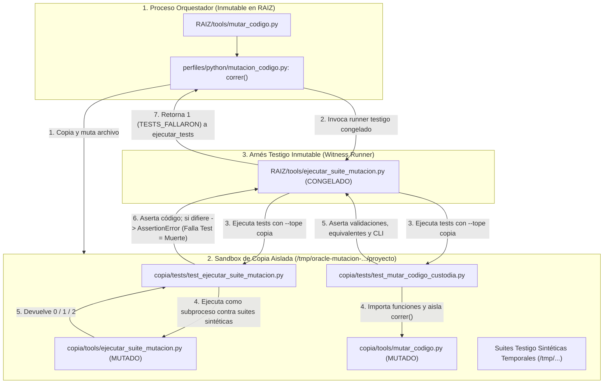

# Diseño Fase 2: Custodia y Verificación por Mutación de los Arneses de Código

- **Tarea:** `20260924-233457-custodia`
- **Fecha:** 2026-09-24
- **Condición:** SÓLO diseño sin código, sin ejecución en shell y sin commits.
- **Objetivos analizados:** [`tools/ejecutar_suite_mutacion.py`](../../tools/ejecutar_suite_mutacion.py) y [`tools/mutar_codigo.py`](../../tools/mutar_codigo.py).

---

## 1. El problema de autorreferencia: por qué el arnés mutado no puede juzgar a su propio mutante

### 1.1. Mecanismo actual de ejecución en `mutar_codigo.py` y `perfiles/python/mutacion_codigo.py`

En el estado actual del repositorio, la mutación de código opera de la siguiente manera:
1. En [`tools/mutar_codigo.py:46`](../../tools/mutar_codigo.py#L46), se define el runner predeterminado:
   ```python
   TESTS = [sys.executable, str(RAIZ / "tools" / "ejecutar_suite_mutacion.py")]
   ```
2. Al ejecutar la ronda ([`tools/mutar_codigo.py:700-707`](../../tools/mutar_codigo.py#L700-L707)), se invoca `correr(RAIZ, objetivos, comando_tests, ...)`.
3. En [`perfiles/python/mutacion_codigo.py:1113-1117`](../../perfiles/python/mutacion_codigo.py#L1113-L1117), `correr` crea un directorio temporal y copia todo el proyecto:
   ```python
   with tempfile.TemporaryDirectory(prefix="oracle-mutacion-") as temporal:
       copia = Path(temporal) / "proyecto"
       _copiar_proyecto(raiz, copia)
       objetivos_copia = [copia / ruta.resolve().relative_to(raiz) for ruta in objetivos]
       comando_copia = _comando_en_copia(comando, raiz, copia)
   ```
4. La función `_comando_en_copia` en [`perfiles/python/mutacion_codigo.py:863-876`](../../perfiles/python/mutacion_codigo.py#L863-L876) reescribe cualquier argumento de ruta absoluta que resida dentro de `raiz` hacia `copia`:
   ```python
   for argumento in comando:
       reemplazo = argumento
       try:
           ruta = Path(argumento)
           if ruta.is_absolute():
               relativa = ruta.resolve(strict=False).relative_to(raiz_fisica)
               reemplazo = str(copia / relativa)
       except (OSError, ValueError):
           pass
       salida.append(reemplazo)
   ```
5. Esto transforma `TESTS` en `[sys.executable, str(copia / "tools" / "ejecutar_suite_mutacion.py")]`.
6. En [`perfiles/python/mutacion_codigo.py:948-952`](../../perfiles/python/mutacion_codigo.py#L948-L952), para cada mutante del objetivo, se escribe el código mutado en `copia` y se llama a `_ejecutar_ronda(comando_copia, copia, ...)`.
7. `_ejecutar_ronda` invoca a `ejecutar_tests` ([`perfiles/python/mutacion_codigo.py:618-621`](../../perfiles/python/mutacion_codigo.py#L618-L621)), que lanza un subproceso con `subprocess.Popen(comando, cwd=str(raiz), ...)` ([`perfiles/python/mutacion_codigo.py:534-536`](../../perfiles/python/mutacion_codigo.py#L534-L536)).
8. Finalmente, `ejecutar_tests` clasifica el resultado según el código de salida del subproceso ([`perfiles/python/mutacion_codigo.py:574-580`](../../perfiles/python/mutacion_codigo.py#L574-L580)):
   - `codigo == 0`: `EstadoTests.PASARON` (el mutante sobrevivió).
   - `codigo in codigos` (donde `codigos` es `{1}` por omisión, [`perfiles/python/mutacion_codigo.py:100`](../../perfiles/python/mutacion_codigo.py#L100)): `EstadoTests.TESTS_FALLARON` (el mutante murió).
   - Cualquier otro código (incluido `2`): `EstadoTests.ERROR_ARNES`.

---

### 1.2. Modos de falla si `tools/ejecutar_suite_mutacion.py` se ejecuta a sí mismo mutado

Si `tools/ejecutar_suite_mutacion.py` entra como objetivo de mutación sin desacoplamiento, el script mutado en `copia` es el mismo que se invoca en el subproceso para evaluar si la suite pasa o falla. Esto genera los siguientes modos de falla catastrófica:

1. **Falso verde / Mutante sobreviviente espurio:**
   - En [`tools/ejecutar_suite_mutacion.py:90`](../../tools/ejecutar_suite_mutacion.py#L90): `return 0 if resultado.wasSuccessful() else 2`. Si el operador `retorno` muta la instrucción a `return None` (que en Python sale con código `0`) o una constante altera el ternario, el runner retorna `0` incondicionalmente.
   - En [`perfiles/python/mutacion_codigo.py:574-575`](../../perfiles/python/mutacion_codigo.py#L574-L575), el código `0` es interpretado como `EstadoTests.PASARON`. Un runner completamente destruido aparecería como mutante «VIVO» (sobreviviente), o peor, daría una línea base verde espuria sobre tests rotos.
   - En [`tools/ejecutar_suite_mutacion.py:61-63`](../../tools/ejecutar_suite_mutacion.py#L61-L63) y [`tools/ejecutar_suite_mutacion.py:88-89`](../../tools/ejecutar_suite_mutacion.py#L88-L89): Si los operadores booleanos (`or` → `and`) o de retorno se mutan, los fallos (`resultado.failures`) o errores (`resultado.errors`) se ignoran, retornando `0` en vez de `1`.

2. **Falsa ronda inconclusa (`ERROR_ARNES` en vez de muerte):**
   - En [`tools/ejecutar_suite_mutacion.py:58, 69, 76, 79, 83, 87`](../../tools/ejecutar_suite_mutacion.py#L58), cualquier falla interna del runner (error de importación, descubrimiento inválido, excepción no capturada en `except Exception: return 2`) sale con código `2`.
   - En [`perfiles/python/mutacion_codigo.py:578-579`](../../perfiles/python/mutacion_codigo.py#L578-L579), el código `2` se clasifica como `EstadoTests.ERROR_ARNES`.
   - En [`perfiles/python/mutacion_codigo.py:956, 965`](../../perfiles/python/mutacion_codigo.py#L956), la condición de muerte del mutante es estrictamente:
     ```python
     murio = resultado.tests_fallaron  # True únicamente si codigo == 1
     ```
   - Por tanto, ante un código `2`, el mutante no muere: se suma a `errores_arnes` ([`perfiles/python/mutacion_codigo.py:989`](../../perfiles/python/mutacion_codigo.py#L989)).
   - En [`tools/mutar_codigo.py:732-736, 778-784`](../../tools/mutar_codigo.py#L732-L736), cualquier ronda con `errores_arnes > 0` se declara inmediatamente `RONDA INCONCLUSA` (retornando código `2`). La mutación no puede completarse.

3. **Degradación extrema por pérdida de `failfast`:**
   - En [`tools/ejecutar_suite_mutacion.py:26`](../../tools/ejecutar_suite_mutacion.py#L26): `unittest.TextTestRunner(verbosity=1, failfast=True)`. Si el operador `constante` muta `True → False`, se desactiva `failfast`.
   - En vez de abortar en el primer fallo (~0.05 segundos), el subproceso correría los 2450+ tests del repositorio completo para cada uno de los mutantes, elevando el tiempo de corrida de segundos a horas.

4. **Recursión o filtrado erróneo en descubrimiento:**
   - En [`tools/ejecutar_suite_mutacion.py:29-40`](../../tools/ejecutar_suite_mutacion.py#L29-L40): Si `_sin_modulos` se rompe por mutación de `not` o `or`, los módulos prioritarios se vuelven a ejecutar en el descubrimiento general, o bien tests críticos dejan de ejecutarse por exclusión espuria.

---

### 1.3. Modos de falla si `tools/mutar_codigo.py` corre sobre sí mismo

`tools/mutar_codigo.py` es el orquestador de nivel superior de la ronda de mutación de código:
- Cuando se muta `<copia>/tools/mutar_codigo.py`, el proceso orquestador principal se está ejecutando desde `RAIZ / "tools" / "mutar_codigo.py"` y permanece inalterado en la memoria del intérprete padre.
- Sin embargo, los tests que comprueban `mutar_codigo.py` se ejecutan dentro del subproceso runner. Como dicho subproceso incluye a `copia` al tope de `sys.path` ([`tools/ejecutar_suite_mutacion.py:48`](../../tools/ejecutar_suite_mutacion.py#L48)), cualquier `from tools import mutar_codigo` cargará el código mutado.
- **Riesgo de bloqueo y recursión infinita:**
  - Si un test unitario llegara a invocar `mutar_codigo.main()` o `mutar_codigo._ejecutar()` sin aislar la llamada a `correr()`, el código mutado intentaría lanzar una *segunda ronda de mutación*.
  - En [`perfiles/python/mutacion_codigo.py:801-806`](../../perfiles/python/mutacion_codigo.py#L801-L806), `_bloqueo_de_ronda` intentaría adquirir el lock `fcntl.flock(archivo.fileno(), fcntl.LOCK_EX | fcntl.LOCK_NB)` sobre el mismo repositorio, fallando con `RondaEnCurso` o colgando el proceso hasta el timeout (`60.0 s`).
  - Por ello, `mutar_codigo.py` no puede ser verificado mediante tests unitarios que ejecuten la mutación real de Oracle; requiere pruebas unitarias con dependencias aisladas o mocks de `correr`.

---

## 2. Arquitectura de Desacoplamiento

Para garantizar que un mutante en `tools/ejecutar_suite_mutacion.py` o en `tools/mutar_codigo.py` sea juzgado con absoluta fidelidad sin autorreferencia ni falsos `ERROR_ARNES`, se define una arquitectura desacoplada en dos niveles:



### 2.1. Desacoplamiento de `tools/ejecutar_suite_mutacion.py`

El desacoplamiento se fundamenta en separar el **ejecutor de la ronda** del **sujeto bajo prueba**:

1. **Arnés Testigo Inmutable (`witness runner`):**
   - El script ejecutado directamente por `subprocess.Popen` en [`perfiles/python/mutacion_codigo.py:534`](../../perfiles/python/mutacion_codigo.py#L534) debe ser **la versión inmutable de la raíz base**:
     `RAIZ / "tools" / "ejecutar_suite_mutacion.py"`.
   - Modificación requerida en `perfiles/python/mutacion_codigo.py:863-876` (`_comando_en_copia`):
     Actualmente, `_comando_en_copia` reescribe ciegamente toda ruta absoluta hacia `copia`. Se debe añadir un mecanismo de exclusión (o parámetro explícito) para que los arneses declarados como testigos inmutables permanezcan apuntando a `RAIZ`.
   - El runner testigo se invoca pasando `--tope` y `--inicio` orientados al sandbox temporal:
     ```bash
     python <RAIZ>/tools/ejecutar_suite_mutacion.py --tope <copia> --inicio <copia>/tests --prioridad tests.test_ejecutar_suite_mutacion
     ```
   - Gracias a las líneas [`tools/ejecutar_suite_mutacion.py:46-48`](../../tools/ejecutar_suite_mutacion.py#L46-L48), el runner testigo inserta `tope` (`<copia>`) al inicio de `sys.path`. Así, el runner testigo es 100% confiable y no sufre mutaciones, pero los tests que descubre y ejecuta provienen de `copia`.

2. **Suites Testigo Sintéticas y Programadas (Programmed Witness Suites):**
   - Para no pagar el costo de correr 2450+ tests de Oracle en cada mutante, `tools/ejecutar_suite_mutacion.py` declara como prioridad exclusiva a [`tests/test_ejecutar_suite_mutacion.py`](../../tests/test_ejecutar_suite_mutacion.py).
   - Este archivo de tests crea suites sintéticas diminutas en directorios temporales (`tempfile.TemporaryDirectory`) con comportamientos exactamente programados (éxito, fallo de aserción, excepción inesperada, syntax error en descubrimiento, directorio vacío, etc.).
   - El test invoca al script mutado (`<copia>/tools/ejecutar_suite_mutacion.py`) sobre cada suite testigo y comprueba el código de salida devuelto:
     - Si el mutante en `ejecutar_suite_mutacion.py` devuelve `0` ante un fallo de aserción (que debía dar `1`), el test lanza un `AssertionError` (`assert salida == 1, got 0`).
     - Al fallar la aserción en el test, el **arnés testigo inmutable** registra un fallo legítimo y retorna código `1` (`EstadoTests.TESTS_FALLARON`).
     - El mutante es clasificado como **MUERTO** ([`perfiles/python/mutacion_codigo.py:956`](../../perfiles/python/mutacion_codigo.py#L956)).
     - Si el mutante crashea prematuramente o retorna `2` ante una suite limpia que debía dar `0`, el test lanza `AssertionError` (`assert salida == 0, got 2`). El arnés testigo devuelve `1` y el mutante **muere por aserción incumplida**, impidiendo que se registre como `ERROR_ARNES`.

---

### 2.2. Desacoplamiento de `tools/mutar_codigo.py`

`tools/mutar_codigo.py` cuenta con 828 líneas de código estructuradas en módulos lógicos bien diferenciados:
1. **Funciones puras y utilitarias de equivalentes y CLI:**
   - `parsear_rango_lineas` ([`tools/mutar_codigo.py:389-404`](../../tools/mutar_codigo.py#L389-L404)).
   - `leer_declaraciones_equivalentes` ([`tools/mutar_codigo.py:436-469`](../../tools/mutar_codigo.py#L436-L469)).
   - `cargar_equivalentes` ([`tools/mutar_codigo.py:472-480`](../../tools/mutar_codigo.py#L472-L480)).
   - `reapuntar_equivalentes` ([`tools/mutar_codigo.py:482-624`](../../tools/mutar_codigo.py#L482-L624)).
   - `equivalentes_del_alcance` ([`tools/mutar_codigo.py:627-652`](../../tools/mutar_codigo.py#L627-L652)).
   - `objetivos_disponibles` y `resolver_objetivos` ([`tools/mutar_codigo.py:330-361`](../../tools/mutar_codigo.py#L330-L361)).
   - `comando_de_tests` ([`tools/mutar_codigo.py:364-372`](../../tools/mutar_codigo.py#L364-L372)).
   - `dependencias_de_ronda` ([`tools/mutar_codigo.py:375-382`](../../tools/mutar_codigo.py#L375-L382)).
   Todas estas funciones operan sobre estructuras de datos en memoria, archivos JSON o el AST sin lanzar subprocesos de mutación. Se prueban exhaustivamente mediante tests unitarios directos.
2. **Orquestación y Despacho CLI (`_ejecutar` y `main`):**
   - [`tools/mutar_codigo.py:654-825`](../../tools/mutar_codigo.py#L654-L825).
   - Para verificar las bifurcaciones de códigos de salida (`0`, `1`, `2`), el manejo de `LineaBaseFallida`, la detección de rondas parciales y las medidas aplicables sin provocar recursión:
     - Los tests deben mockear `correr()` (o invocar `_ejecutar` con un doble de prueba que retorne diccionarios de evidencia controlados).
     - Si se requiere una prueba de integración end-to-end, se ejecuta sobre un micro-proyecto temporal aislado con comandos sintéticos (ej. `SIEMPRE_PASA` o `SIEMPRE_FALLA`), garantizando que jamás se invoque la mutación real sobre la raíz de Oracle durante el test.

---

## 3. Inventario Detallado de Tests Requeridos

### 3.1. Tests para `tools/ejecutar_suite_mutacion.py` (en `tests/test_ejecutar_suite_mutacion.py`)

Se requiere crear un nuevo archivo de pruebas unitarias enfocado exclusivamente en validar el contrato del runner:

1. **Protocolo de Salida: Éxito (Código 0)**
   - `test_suite_exitosa_retorna_codigo_0`:
     Ejecuta una suite con tests `unittest.TestCase` que pasan (`self.assertTrue(True)`). Verifica que el código de retorno sea estrictamente `0` ([`tools/ejecutar_suite_mutacion.py:90`](../../tools/ejecutar_suite_mutacion.py#L90)).
   - `test_was_successful_retorna_0_solo_si_no_hay_fallos`:
     Comprueba que la evaluación ternaria `0 if resultado.wasSuccessful() else 2` sea estricta ([`tools/ejecutar_suite_mutacion.py:90`](../../tools/ejecutar_suite_mutacion.py#L90)).

2. **Protocolo de Salida: Fallos Discriminantes y Excepciones (Código 1)**
   - `test_fallo_de_asercion_retorna_codigo_1`:
     Ejecuta una suite donde un test falla (`self.assertEqual(1, 2)`). Comprueba que retorne `1` ([`tools/ejecutar_suite_mutacion.py:88-89`](../../tools/ejecutar_suite_mutacion.py#L88-L89)).
   - `test_excepcion_en_cuerpo_de_test_retorna_codigo_1`:
     Ejecuta un test que lanza `raise RuntimeError("error esperado")`. Comprueba que `resultado.errors` produzca salida `1` ([`tools/ejecutar_suite_mutacion.py:88-89`](../../tools/ejecutar_suite_mutacion.py#L88-L89)).
   - `test_unexpected_success_retorna_codigo_1`:
     Ejecuta un test decorado con `@unittest.expectedFailure` que inesperadamente pasa. Comprueba que `resultado.unexpectedSuccesses` produzca salida `1` ([`tools/ejecutar_suite_mutacion.py:61-62, 88-89`](../../tools/ejecutar_suite_mutacion.py#L61-L62)).

3. **Módulos Prioritarios y Failfast (Código 1 sin ejecutar el resto)**
   - `test_prioridad_fallida_retorna_1_inmediato_sin_descubrimiento`:
     Configura `--prioridad modulo_fallo`. El módulo prioritario falla. Verifica retorno `1` y confirma mediante un archivo centinela que los tests del directorio general `--inicio` NO llegaron a ejecutarse ([`tools/ejecutar_suite_mutacion.py:61-63, 70-72`](../../tools/ejecutar_suite_mutacion.py#L61-L63)).
   - `test_prioridad_exitosa_continua_a_descubrimiento_general`:
     Módulo prioritario pasa; verifica que la suite general se ejecute a continuación y acumule `tests_prioritarios + resultado.testsRun` ([`tools/ejecutar_suite_mutacion.py:64-73, 81`](../../tools/ejecutar_suite_mutacion.py#L64-L73)).
   - `test_runner_ejecuta_con_failfast_true`:
     Verifica que `_correr_suite` configure `failfast=True` ([`tools/ejecutar_suite_mutacion.py:25-26`](../../tools/ejecutar_suite_mutacion.py#L25-L26)). Una suite con dos tests que fallan debe detenerse exactamente tras el primero.

4. **Deduplicación de Prioritarios (`_sin_modulos`)**
   - `test_sin_modulos_excluye_modulos_ya_corridos`:
     Verifica que los tests descubiertos cuyo `id()` comience con el prefijo de los módulos prioritarios sean excluidos del `TestSuite` general ([`tools/ejecutar_suite_mutacion.py:29-40`](../../tools/ejecutar_suite_mutacion.py#L29-L40)).
   - `test_sin_modulos_con_lista_vacia_no_filtra_nada`:
     Verifica que si `args.prioridad` está vacío, ningún caso sea omitido ([`tools/ejecutar_suite_mutacion.py:37`](../../tools/ejecutar_suite_mutacion.py#L37)).

5. **Protocolo de Salida: Errores de Arnés (Código 2)**
   - `test_modulo_prioritario_inexistente_retorna_codigo_2`:
     Pasa `--prioridad no_existe`. Verifica retorno `2` y mensaje en stderr ([`tools/ejecutar_suite_mutacion.py:53-58`](../../tools/ejecutar_suite_mutacion.py#L53-L58)).
   - `test_error_de_sintaxis_durante_descubrimiento_retorna_codigo_2`:
     Coloca un archivo con sintaxis rota en el directorio de descubrimiento. Verifica retorno `2` ([`tools/ejecutar_suite_mutacion.py:66-69, 84-87`](../../tools/ejecutar_suite_mutacion.py#L66-L69)).
   - `test_cero_tests_descubiertos_retorna_codigo_2`:
     Directorio vacío sin tests. Verifica retorno `2` ([`tools/ejecutar_suite_mutacion.py:81-83`](../../tools/ejecutar_suite_mutacion.py#L81-L83)).
   - `test_system_exit_en_descubrimiento_retorna_codigo_2`:
     Módulo de test que invoca `sys.exit(0)` a nivel de módulo al importarse. Verifica que `except SystemExit` atrape la salida y retorne `2` ([`tools/ejecutar_suite_mutacion.py:74-76`](../../tools/ejecutar_suite_mutacion.py#L74-L76)).
   - `test_excepcion_en_descubrimiento_retorna_codigo_2`:
     Módulo que lanza excepción no estándar durante la importación. Verifica retorno `2` ([`tools/ejecutar_suite_mutacion.py:77-79`](../../tools/ejecutar_suite_mutacion.py#L77-L79)).

6. **Configuración de Entorno e Importación**
   - `test_tope_se_inserta_en_sys_path`:
     Verifica que `Path(args.tope).resolve()` se inserte en `sys.path[0]` si no estaba presente ([`tools/ejecutar_suite_mutacion.py:46-48`](../../tools/ejecutar_suite_mutacion.py#L46-L48)).

---

### 3.2. Tests para `tools/mutar_codigo.py` (en `tests/test_mutar_codigo_custodia.py`)

Módulo dedicado a custodiar la lógica interna de `tools/mutar_codigo.py`:

1. **Gestión y Validación de `equivalentes.json`**
   - `test_leer_declaraciones_archivo_inexistente_retorna_lista_vacia` ([`tools/mutar_codigo.py:442-444`](../../tools/mutar_codigo.py#L442-L444)).
   - `test_leer_declaraciones_rechaza_raiz_no_lista` ([`tools/mutar_codigo.py:448-449`](../../tools/mutar_codigo.py#L448-L449)).
   - `test_leer_declaraciones_rechaza_elementos_no_diccionario` ([`tools/mutar_codigo.py:453-454`](../../tools/mutar_codigo.py#L453-L454)).
   - `test_leer_declaraciones_exige_id_y_razon_texto_no_vacio` ([`tools/mutar_codigo.py:455-459`](../../tools/mutar_codigo.py#L455-L459)).
   - `test_leer_declaraciones_valida_linea_texto_y_ordinal_entero_positivo` ([`tools/mutar_codigo.py:460-465`](../../tools/mutar_codigo.py#L460-L465)).
   - `test_leer_declaraciones_rechaza_ids_duplicados` ([`tools/mutar_codigo.py:466-468`](../../tools/mutar_codigo.py#L466-L468)).
   - `test_cargar_equivalentes_devuelve_diccionario_id_razon` ([`tools/mutar_codigo.py:472-480`](../../tools/mutar_codigo.py#L472-L480)).

2. **Reubicación de Equivalentes (`reapuntar_equivalentes`)**
   - `test_reapuntar_archivo_inexistente_o_invalido_retorna_1` ([`tools/mutar_codigo.py:494-502`](../../tools/mutar_codigo.py#L494-L502)).
   - `test_reapuntar_id_malformado_o_columnas_no_numericas_falla` ([`tools/mutar_codigo.py:525-535`](../../tools/mutar_codigo.py#L525-L535)).
   - `test_reapuntar_archivo_fuente_inexistente_falla` ([`tools/mutar_codigo.py:538-540`](../../tools/mutar_codigo.py#L538-L540)).
   - `test_reapuntar_puebla_metadatos_en_id_vigente_sin_linea_texto` ([`tools/mutar_codigo.py:550-559`](../../tools/mutar_codigo.py#L550-L559)).
   - `test_reapuntar_id_no_vigente_sin_metadatos_falla` ([`tools/mutar_codigo.py:560-561`](../../tools/mutar_codigo.py#L560-L561)).
   - `test_reapuntar_contenido_linea_texto_no_encontrado_falla` ([`tools/mutar_codigo.py:564-567`](../../tools/mutar_codigo.py#L564-L567)).
   - `test_reapuntar_ordinal_supera_ocurrencias_falla` ([`tools/mutar_codigo.py:569-573`](../../tools/mutar_codigo.py#L569-L573)).
   - `test_reapuntar_falla_si_ast_no_contiene_operador_en_nueva_posicion` ([`tools/mutar_codigo.py:580-584`](../../tools/mutar_codigo.py#L580-L584)).
   - `test_reapuntar_actualiza_id_y_escribe_json_ordenado` ([`tools/mutar_codigo.py:586-606`](../../tools/mutar_codigo.py#L586-L606)).
   - `test_reapuntar_sin_cambios_mantiene_intactos_y_retorna_0` ([`tools/mutar_codigo.py:587, 616-624`](../../tools/mutar_codigo.py#L587)).

3. **Filtrado por Alcance (`equivalentes_del_alcance`)**
   - `test_equivalentes_del_alcance_detecta_vencidos_globales` ([`tools/mutar_codigo.py:639-647`](../../tools/mutar_codigo.py#L639-L647)).
   - `test_equivalentes_del_alcance_recorta_solo_a_los_objetivos_de_la_ronda` ([`tools/mutar_codigo.py:648-652`](../../tools/mutar_codigo.py#L648-L652)).

4. **Resolución de Objetivos y Comandos**
   - `test_resolver_objetivos_omision_devuelve_todos_disponibles` ([`tools/mutar_codigo.py:353-354`](../../tools/mutar_codigo.py#L353-L354)).
   - `test_resolver_objetivos_rechaza_objetivo_desconocido` ([`tools/mutar_codigo.py:355-358`](../../tools/mutar_codigo.py#L355-L358)).
   - `test_resolver_objetivos_rechaza_objetivos_duplicados` ([`tools/mutar_codigo.py:359-360`](../../tools/mutar_codigo.py#L359-L360)).
   - `test_comando_de_tests_sin_priorizar_devuelve_base` ([`tools/mutar_codigo.py:365`](../../tools/mutar_codigo.py#L365)).
   - `test_comando_de_tests_con_priorizar_inyecta_modulos_en_orden_deduplicado` ([`tools/mutar_codigo.py:366-372`](../../tools/mutar_codigo.py#L366-L372)).
   - `test_dependencias_de_ronda_incluye_carpetas_clave_y_runner_y_excluye_pycache` ([`tools/mutar_codigo.py:375-382`](../../tools/mutar_codigo.py#L375-L382)).

5. **Orquestación, Evaluación y Códigos de Salida (`_ejecutar` y `main`)**
   - `test_ejecutar_excepciones_del_arnes_imprimen_diagnostico_y_retornan_2` ([`tools/mutar_codigo.py:708-727`](../../tools/mutar_codigo.py#L708-L727)).
   - `test_ejecutar_ronda_inconclusa_por_timeout_o_error_arnes_retorna_2` ([`tools/mutar_codigo.py:732-736, 778-784`](../../tools/mutar_codigo.py#L732-L736)).
   - `test_ejecutar_sobrevivientes_reales_retorna_1` ([`tools/mutar_codigo.py:786-795`](../../tools/mutar_codigo.py#L786-L795)).
   - `test_ejecutar_todos_muertos_ronda_completa_retorna_0` ([`tools/mutar_codigo.py:805-806`](../../tools/mutar_codigo.py#L805-L806)).
   - `test_ejecutar_todos_muertos_ronda_parcial_retorna_2` ([`tools/mutar_codigo.py:796-804`](../../tools/mutar_codigo.py#L796-L804)).
   - `test_ejecutar_evalua_medidas_aplicables_del_catalogo_y_muestra_veredictos` ([`tools/mutar_codigo.py:768-776`](../../tools/mutar_codigo.py#L768-L776)).
   - `test_main_despacha_a_reapuntar_equivalentes` ([`tools/mutar_codigo.py:812-814`](../../tools/mutar_codigo.py#L812-L814)).
   - `test_main_retorna_2_si_proyecto_no_resuelve` ([`tools/mutar_codigo.py:815-817`](../../tools/mutar_codigo.py#L815-L817)).
   - `test_main_atrapa_escalares_invalidas_y_retorna_2` ([`tools/mutar_codigo.py:821-823`](../../tools/mutar_codigo.py#L821-L823)).

---

## 4. Análisis Detallado: «Qué Rompe» (Mapeo de Fallas por Operador AST)

### 4.1. Qué rompe en `tools/ejecutar_suite_mutacion.py`

| Línea | Código Original | Mutación de Operador AST | Mecanismo de Falla / Efecto Observable | Test que lo Mata |
|:---|:---|:---|:---|:---|
| [`l.26`](../../tools/ejecutar_suite_mutacion.py#L26) | `failfast=True` | `constante: True → False` | El runner deja de detenerse ante el primer fallo. Corre todos los tests restantes para cada mutante, disparando el tiempo de ejecución. | `test_runner_ejecuta_con_failfast_true` |
| [`l.26`](../../tools/ejecutar_suite_mutacion.py#L26) | `return unittest.TextTestRunner...` | `retorno: return <algo> → None` | `_correr_suite` devuelve `None`; colapsa con `AttributeError` en `resultado.failures` en l.61 y l.88. | `test_suite_exitosa_retorna_codigo_0` |
| [`l.37`](../../tools/ejecutar_suite_mutacion.py#L37) | `elif not modulos or not caso.id()...` | `booleano: or → and` | La guarda exige que no haya módulos Y que el caso no empiece con el prefijo. Con módulos prioritarios presentes, ningún caso es yield-eado (suite vacía). | `test_sin_modulos_excluye_modulos_ya_corridos` |
| [`l.37`](../../tools/ejecutar_suite_mutacion.py#L37) | `not modulos` / `not caso.id()...` | `negacion: se borra not` | Invierte el filtro de exclusión: solo ejecuta lo prioritario y omite todo el resto del repositorio. | `test_sin_modulos_excluye_modulos_ya_corridos` |
| [`l.47`](../../tools/ejecutar_suite_mutacion.py#L47) | `if tope not in sys.path:` | `comparador: not in → in` | Si `tope` no está en `sys.path`, no lo inserta; los imports calificados de los tests fallan con `ModuleNotFoundError`. | `test_tope_se_inserta_en_sys_path` |
| [`l.48`](../../tools/ejecutar_suite_mutacion.py#L48) | `sys.path.insert(0, tope)` | `constante: 0 → 1` | `tope` se inserta con menor prioridad frente al directorio actual. *(Equivalente documentado)*. | `equivalentes.json` |
| [`l.53`](../../tools/ejecutar_suite_mutacion.py#L53) | `if cargador.errors or any(...)` | `booleano: or → and` | No detecta un error de carga prioritaria si sólo uno de los dos indicadores se activa. | `test_modulo_prioritario_inexistente_retorna_codigo_2` |
| [`l.58`](../../tools/ejecutar_suite_mutacion.py#L58) | `return 2` | `constante: 2 → 3` / `retorno: None` | Error en carga prioritaria sale con `3` o `0`; corrompe el protocolo de arnés. | `test_modulo_prioritario_inexistente_retorna_codigo_2` |
| [`l.61`](../../tools/ejecutar_suite_mutacion.py#L61) | `if (resultado_prioritario.failures or ...)` | `booleano: or → and` | Si hay fallos pero no errores (o viceversa), no retorna `1` y sigue al descubrimiento general. | `test_prioridad_fallida_retorna_1_inmediato_sin_descubrimiento` |
| [`l.63`](../../tools/ejecutar_suite_mutacion.py#L63) | `return 1` | `retorno: return 1 → None` / `1 → 2` | Un fallo en prioridad retorna `0` (mutante vivo) o `2` (error de arnés). | `test_prioridad_fallida_retorna_1_inmediato_sin_descubrimiento` |
| [`l.66`](../../tools/ejecutar_suite_mutacion.py#L66) | `if cargador.errors:` → l.69 `return 2` | `constante: 2 → 3` / `retorno: None` | Errores en descubrimiento general retornan `0` en vez de `2`. | `test_error_de_sintaxis_durante_descubrimiento_retorna_codigo_2` |
| [`l.74-79`](../../tools/ejecutar_suite_mutacion.py#L74-L79) | `except SystemExit:` / `except Exception:` | `retorno: return 2 → None` | Excepciones durante descubrimiento retornan `0` en vez de abortar con `2`. | `test_system_exit_en_descubrimiento_retorna_codigo_2` |
| [`l.81`](../../tools/ejecutar_suite_mutacion.py#L81) | `if tests_prioritarios + resultado.testsRun == 0:` | `comparador: == → !=` | Si corrieron tests (> 0), retorna `2` de inmediato; si corrieron 0 tests, continúa a verde `0`. | `test_suite_exitosa_retorna_codigo_0` y `test_cero_tests_descubiertos_retorna_codigo_2` |
| [`l.84`](../../tools/ejecutar_suite_mutacion.py#L84) | `if any(isinstance(caso, _FailedTest)...)` | `retorno: return 2 → None` | Fallas de importación atrapadas como `_FailedTest` devuelven `0` en vez de `2`. | `test_error_de_sintaxis_durante_descubrimiento_retorna_codigo_2` |
| [`l.88`](../../tools/ejecutar_suite_mutacion.py#L88) | `if resultado.failures or resultado.errors...` | `booleano: or → and` | Si una suite general tiene fallos pero no errores, se omite el `return 1` y se evalúa l.90. | `test_fallo_de_asercion_retorna_codigo_1` |
| [`l.89`](../../tools/ejecutar_suite_mutacion.py#L89) | `return 1` | `retorno: return 1 → None` | Fallo de test general retorna `0`; el mutante se reporta como sobreviviente. | `test_fallo_de_asercion_retorna_codigo_1` |
| [`l.90`](../../tools/ejecutar_suite_mutacion.py#L90) | `return 0 if resultado.wasSuccessful() else 2` | `constante: 0 → 1` / `2 → 3` / `retorno: None` | Suite exitosa devuelve `1` o `None`; suite fallida devuelve `3` o `0`. | `test_suite_exitosa_retorna_codigo_0` |

---

### 4.2. Qué rompe en `tools/mutar_codigo.py`

| Línea | Código Original | Mutación de Operador AST | Mecanismo de Falla / Efecto Observable | Test que lo Mata |
|:---|:---|:---|:---|:---|
| [`l.348`](../../tools/mutar_codigo.py#L348) | `if ruta.name != "__init__.py":` | `comparador: != → ==` | Solo recolecta archivos `__init__.py`; ningún objetivo sustantivo queda disponible. | `test_resolver_objetivos_omision_devuelve_todos_disponibles` |
| [`l.353`](../../tools/mutar_codigo.py#L353) | `if not declarados:` | `negacion: se borra not` | Sin `--objetivo` explícito, falla en vez de devolver todos los objetivos disponibles. | `test_resolver_objetivos_omision_devuelve_todos_disponibles` |
| [`l.359`](../../tools/mutar_codigo.py#L359) | `if len(declarados) != len(set(declarados)):` | `comparador: != → ==` | Objetivos duplicados son aceptados y objetivos únicos son rechazados. | `test_resolver_objetivos_rechaza_objetivos_duplicados` |
| [`l.366`](../../tools/mutar_codigo.py#L366) | `if priorizar:` | `constante/booleano` | Omite `--prioridad` en el subproceso aunque se haya solicitado partición. | `test_comando_de_tests_con_priorizar_inyecta_modulos_en_orden_deduplicado` |
| [`l.380`](../../tools/mutar_codigo.py#L380) | `if ruta.is_file() and ... suffix != ".pyc":` | `booleano: and → or` / `comparador: != → ==` | Se incluyen archivos de bytecode `.pyc` en dependencias de ronda, corrompiendo la huella del manifiesto. | `test_dependencias_de_ronda_incluye_carpetas_clave_y_runner_y_excluye_pycache` |
| [`l.399`](../../tools/mutar_codigo.py#L399) | `if inicio < 1 or fin < 1 or inicio > fin:` | `comparadores: < → <=, > → >=` / `booleano` | Rechaza rangos válidos que empiezan en línea 1 o acepta rangos invertidos. | `test_cli_parseo_y_validacion_lineas_y_sitio` |
| [`l.448`](../../tools/mutar_codigo.py#L448) | `if not isinstance(datos, list):` | `negacion: se borra not` | Acepta archivos `equivalentes.json` cuya raíz sea dict u objeto, o rechaza listas válidas. | `test_leer_declaraciones_rechaza_raiz_no_lista` |
| [`l.464`](../../tools/mutar_codigo.py#L464) | `if ordinal is not None and (... or ordinal < 1):` | `comparador: < → <=` | Rechaza `ordinal: 1` legítimo (la primera ocurrencia de la línea). | `test_leer_declaraciones_valida_linea_texto_y_ordinal_entero_positivo` |
| [`l.466`](../../tools/mutar_codigo.py#L466) | `if mid in ids_vistos:` | `comparador: in → not in` | Acepta IDs duplicados en `equivalentes.json` y rechaza IDs únicos. | `test_leer_declaraciones_rechaza_ids_duplicados` |
| [`l.551`](../../tools/mutar_codigo.py#L551) | `if mid in vigentes and 1 <= linea_vieja <= len(lineas):` | `comparadores: <= → <` | Rechaza la primera o última línea de un archivo al poblar metadatos posicionales. | `test_reapuntar_puebla_metadatos_en_id_vigente_sin_linea_texto` |
| [`l.570`](../../tools/mutar_codigo.py#L570) | `if ordinal > len(coincidencias):` | `comparador: > → >=` | Aborta erróneamente cuando el ordinal coincide exactamente con el total de ocurrencias. | `test_reapuntar_actualiza_id_y_escribe_json_ordenado` |
| [`l.581`](../../tools/mutar_codigo.py#L581) | `if nuevo_id not in vigentes:` | `comparador: not in → in` | Acepta reapuntar a un sitio inexistente en el AST o rechaza un sitio existente. | `test_reapuntar_falla_si_ast_no_contiene_operador_en_nueva_posicion` |
| [`l.645`](../../tools/mutar_codigo.py#L645) | `if vencidos:` | `negacion: se borra if` | Silencia equivalentes vencidos; afirmaciones obsoletas sobreviven en el repositorio. | `test_equivalentes_del_alcance_detecta_vencidos_globales` |
| [`l.650`](../../tools/mutar_codigo.py#L650) | `return {mid: razon for ... if mid.rsplit(...) in del_alcance}` | `retorno: return <algo> → None` | No devuelve equivalentes para la partición; mutantes declarados equivalentes hacen fallar CI. | `test_equivalentes_del_alcance_recorta_solo_a_los_objetivos_de_la_ronda` |
| [`l.697`](../../tools/mutar_codigo.py#L697) | `if args.limite_memoria_mb < 0:` | `comparador: < → <=` | `--limite-memoria-mb 0` (que debe desactivar el tope) es rechazado como valor inválido. | `test_cli_limite_memoria_mb_parseo_y_valores` |
| [`l.732-736`](../../tools/mutar_codigo.py#L732-L736) | `ronda_inconclusa = (not corrida["baseline_verde"] ... or corrida["errores_arnes"] > 0 ...)` | `comparadores: > → >=` / `booleanos: or → and` | Una corrida con 0 errores de arnés se marca como inconclusa, o una con errores de arnés se marca erróneamente como conclusa. | `test_ejecutar_ronda_inconclusa_por_timeout_o_error_arnes_retorna_2` |
| [`l.742`](../../tools/mutar_codigo.py#L742) | `return 1 if vivos else 0` | `constante: 1 → 2` / `0 → 1` | Si hay sobrevivientes sale con `2`; o si no hay sobrevivientes sale con `1` en vez de `0`. | `test_ejecutar_sobrevivientes_reales_retorna_1` y `test_ejecutar_todos_muertos_ronda_completa_retorna_0` |
| [`l.784`](../../tools/mutar_codigo.py#L784) | `return 2` (en ronda inconclusa) | `constante: 2 → 3` / `retorno: None` | Ronda inconclusa retorna `0`, haciendo pasar CI falsamente ante fallas de arnés o timeouts. | `test_ejecutar_ronda_inconclusa_por_timeout_o_error_arnes_retorna_2` |
| [`l.804`](../../tools/mutar_codigo.py#L804) | `return 2` (en ronda parcial) | `constante: 2 → 3` / `retorno: None` | Una ronda parcial sale con `0`, permitiendo que un ciclo de desarrollo local incompleto se publique como evidencia completa. | `test_ejecutar_todos_muertos_ronda_parcial_retorna_2` |
| [`l.816`](../../tools/mutar_codigo.py#L816) | `if proy is None: return 2` | `constante: 2 → 3` / `retorno: None` | Error al resolver proyecto retorna `0`. | `test_main_retorna_2_si_proyecto_no_resuelve` |

---

## 5. Costo Estimado, Tiempos y Presupuesto de Mutación

### 5.1. Sitios de Mutación Estimados (Sin Shell)
La estimación se calcula considerando las reglas de mutación sintáctica en [`perfiles/python/mutacion_codigo.py:253-290`](../../perfiles/python/mutacion_codigo.py#L253-L290) (comparadores, booleanos, negaciones, constantes numéricas y booleanas, y retornos no-None):
- **`tools/ejecutar_suite_mutacion.py` (95 líneas):**
  - ~14 retornos con valor no-None.
  - ~10 operadores booleanos (`or`, `and`).
  - ~6 negaciones (`not`).
  - ~8 comparadores (`==`, `in`, `not in`).
  - ~12 constantes numéricas o booleanas (`0`, `1`, `2`, `True`).
  - **Estimación total: 35 a 45 sitios AST**.
- **`tools/mutar_codigo.py` (828 líneas):**
  - Contiene extensos bloques de comentarios y docstrings (~300 líneas) que no generan sitios AST.
  - El código ejecutable concentra ~50 retornos, ~35 booleanos, ~25 negaciones, ~60 comparadores y ~80 constantes.
  - **Estimación total: 220 a 300 sitios AST**.
- **Total conjunto estimado:** entre **255 y 345 sitios de mutación**.

### 5.2. Presupuesto de Tiempo con Desacoplamiento Testigo
- **Para `tools/ejecutar_suite_mutacion.py`:**
  - Al declarar `PRIORIDADES["tools/ejecutar_suite_mutacion.py"] = ("tests.test_ejecutar_suite_mutacion",)` en [`tools/mutar_codigo.py:49`](../../tools/mutar_codigo.py#L49), los mutantes solo ejecutan las micro-suites sintéticas (~0.1 a 0.2 s por mutante).
  - Los ~40 mutantes completarán su ronda en **menos de 15 segundos**.
- **Para `tools/mutar_codigo.py`:**
  - Al declarar `PRIORIDADES["tools/mutar_codigo.py"] = ("tests.test_mutar_codigo_custodia", "tests.test_mutacion_codigo")`, los mutantes mueren en las primeras aserciones unitarias en memoria (< 0.1 s por mutante).
  - Los ~260 mutantes completarán su ronda en **aproximadamente 30 a 60 segundos**.
- *Contraste:* Si no se desacopla y se corre toda la suite general (~40 s por mutante), 300 sitios demandarían más de 3 horas de computación continua. El desacoplamiento testigo convierte una verificación prohibitiva en una ronda rápida y viable para CI.

### 5.3. Mutantes Equivalentes Anticipados
Por inspección del AST, se anticipan 2 mutantes equivalentes análogos a los ya documentados en [`equivalentes.json:57-73`](../../equivalentes.json#L57-L73):
1. `tools/ejecutar_suite_mutacion.py:48`: `sys.path.insert(0, tope)` (`constante: 0 → 1`). La precedencia de `tope` frente a `sys.path[0]` es irrelevante porque no existen módulos en conflicto en el subproceso runner.
2. `tools/mutar_codigo.py:32`: `sys.path.insert(0, str(RAIZ))` (`constante: 0 → 1`). Mismo caso documentado para `cifras.py:23`, `mutar.py:20`, `generar_diferencial.py:23` y `trazar.py:32`.

---

## 6. Plan de Implementación de la Fase 2 (Próximo Paso)

1. **Ajuste del Arnés (`perfiles/python/mutacion_codigo.py`):**
   - En [`perfiles/python/mutacion_codigo.py:863-876`](../../perfiles/python/mutacion_codigo.py#L863-L876), incorporar la exclusión de reescritura para el ejecutor testigo inmutable cuando se mute `ejecutar_suite_mutacion.py`.
2. **Creación de la Suite Testigo:**
   - Escribir [`tests/test_ejecutar_suite_mutacion.py`](../../tests/test_ejecutar_suite_mutacion.py) con las suites programadas para los códigos `0`, `1` y `2`.
3. **Creación de la Suite de Custodia del CLI:**
   - Escribir [`tests/test_mutar_codigo_custodia.py`](../../tests/test_mutar_codigo_custodia.py) con las pruebas de esquema, reubicación y orquestación.
4. **Incorporación a Custodias y CI:**
   - Sumar `ejecutar_suite_mutacion.py` y `mutar_codigo.py` a `HERRAMIENTAS_CUSTODIAS` en [`tools/mutar_codigo.py:313-319`](../../tools/mutar_codigo.py#L313-L319).
   - Definir sus entradas en `PRIORIDADES` en [`tools/mutar_codigo.py:49-168`](../../tools/mutar_codigo.py#L49-L168).
   - Incorporarlos a la matriz de CI en [`.github/workflows/verificar.yml`](../../.github/workflows/verificar.yml).
   - Añadirlos a las aserciones de presencia de [`tests/test_herramientas.py:2487-2490`](../../tests/test_herramientas.py#L2487-L2490).
5. **Medición y Cierre:**
   - Medir los sitios reales en corrida controlada, fijar los mutantes vivos con tests específicos y documentar los equivalentes en `equivalentes.json`.
